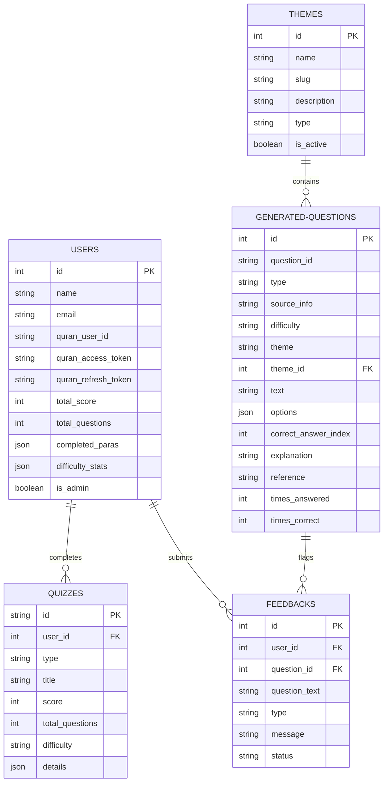

# 🌟 The Eternal Echo — AI-Powered Islamic Learning Platform


## 📖 Introduction & Philosophy

**The Eternal Echo** is a premium, state-of-the-art web application designed to transform how we learn, review, and connect with the Holy Quran and the Seerah (life) of Prophet Muhammad ﷺ. Developed under the **Asloob ul Hayat Project**, it merges modern AI technology with rich spiritual learning, providing students, educators, and curious minds with a highly interactive, personalized, and gamified educational ecosystem.

Unlike generic trivia apps, **The Eternal Echo** leverages the intelligence of Google's **Gemini 1.5 Flash API** to dynamically generate contextually precise questions, deep theological insights, and comprehensive historical explanations tailored to the exact difficulty levels selected by learners. 


## 🚀 Future Roadmap & Vision

We are constantly working to expand **The Eternal Echo** to make it the ultimate digital companion for Islamic education. Some of our key future initiatives include:

- **👥 Islamic Study Clubs & Halaqas:**
  - Create and join digital learning clubs or study circles.
  - Collaborative group challenges, team leaderboards, and shared learning milestones.
  - Real-time discussion threads and peer-to-peer tutoring inside clubs.

- **📚 Quizzes from Authentic Islamic Literature:**
  - Dynamic test generation from classical and contemporary Islamic texts, including:
    - **Hadith Collections:** *Sahih al-Bukhari*, *Sahih Muslim*, and *Riyadh as-Salihin*.
    - **Seerah Classics:** *Ar-Raheeq Al-Makhtum* (The Sealed Nectar).
    - **Tafsir & Theology:** *Tafsir Ibn Kathir* and foundational creed texts.
  - **Literatures of Every Scholar:** Explore custom quizzes derived from the comprehensive books, publications, rulings, and works of renowned historical and contemporary Islamic scholars across all major schools of thought.
  - Ability to choose a specific book, scholar, chapter, or topic as a custom quiz source.

- **🌐 Broadened Knowledge Sources:**
  - Integration with open-source Islamic APIs, verified academic databases, and digital libraries.
  - Cross-referencing questions with multiple scholarly commentaries to provide balanced and rich explanations.

- **🤖 AI Spiritual Companions & Tutors:**
  - Contextual AI study guides to answer theological and historical questions in real time.
  - Adaptive study planners that identify your weaker topics and suggest specific reading schedules.

- **🌍 Multilingual Expansion:**
  - Translating the application interface and dynamically generated quizzes into languages like Arabic, Urdu, French, Spanish, and Turkish.


## ✨ Features

### 🕌 Interactive Quranic Mastery
- **Para-by-Para Exploration:** Systematic multiple-choice quizzes spanning all 30 Paras (Juz) of the Holy Quran.
- **Dynamic AI Generation:** When the database doesn't have enough pre-stored questions for a selected Para and difficulty, the app generates fresh, high-quality MCQs on the fly using Gemini.
- **Deep Referencing:** Every question comes with a precise theological citation (Surah and Ayat numbers) and an in-depth explanation of the wisdom behind it.

### 📜 Chronological Seerah Timelines
- **Historical Journey:** Engage with chronologically ordered Seerah questions covering major eras:
  - *Prophet Muhammad's ﷺ Early Life*
  - *The Revelation*
  - *Persecution in Makkah*
  - *The Hijrah (Migration)*
  - *Life in Madinah*
- **Spiritual Bond:** Reinforce historical memory and cultivate a deep emotional connection to the character and teachings of the Prophet ﷺ.

### 🧠 Personalized AI Learning & Daily Insights
- **Seerah Insights:** A daily dose of inspiration and educational narrative followed by interactive review questions.
- **Quranic History Insights:** Delve into the preservation, compilation, and linguistic miracles of the Holy Quran with accompanied assessments.
- **Dynamic Difficulty:** Quizzes adapt to three tailored cognitive levels:
  - **Easy:** Direct recall, names, major events, and foundational facts.
  - **Medium:** Wisdom behind events, roles of key figures, and logical application.
  - **Hard:** Nuanced theological arguments, historical context, and deep scriptural interpretation.

### 🔑 Unified Islamic OAuth & Seamless Sync
- **Quran.com OAuth Integration:** Unified profile syncing. Authenticating through Quran.com automatically links your account, allowing the platform to:
  - Synchronize reading milestones.
  - Retrieve active Quran reading streaks to showcase on your dashboard.
  - Seamlessly post and record your daily reading sessions directly back to the Quran Foundation API.
- **Passwordless Secure OTP:** Fast, secure, and passwordless authentication using a 6-digit email OTP. The login process features a **personalized spiritual welcome message** generated dynamically by AI based on your email name.

### 🏆 Gamified Tracking & Community
- **Comprehensive Statistics:** Track your learning streak, overall accuracy, scores by difficulty level, and completed Paras.
- **Personal Bookmarks:** Bookmark challenging questions to build a personalized study notebook for offline review.
- **Global Leaderboard:** Engage in healthy competition with learners worldwide via an interactive, real-time leaderboard showing scores, questions answered, and rank.

### 🛡️ Premium Administration & Moderation
- **User Management:** Easily toggle administrative privileges for trusted moderators.
- **Feedback Loop:** Learners can directly submit feedback (corrections, suggestions, praise) on any question they encounter. Admins review feedback from a central dashboard.
- **Intelligent Deduplication:** Automated detection of duplicate questions with a bulk-deletion interface.
- **Theme Builder:** Manage, merge, and organize Para/Seerah themes seamlessly.

---

## 🛠️ Technology Stack

The platform is built using a modern, robust, and highly optimized web development stack:

- **Backend Framework:** Laravel 12.x (leveraging modern routing, robust models, and secure middleware).
- **Frontend / Build Tool:** Vite + Alpine.js (for reactive, lightning-fast interactive client components).
- **Styling System:** Tailwind CSS v4.0.0 (featuring modern HSL tailored palettes, slate/emerald ambient dark theme, and premium glassmorphic UI designs).
- **Database Layer:** SQLite (highly performant, zero-configuration local database perfectly structured for quick reading and local caching).
- **AI Core:** Google Gemini 1.5 Flash (utilizing structured JSON schemas for seamless API responses).
- **External Integration:** Quran.com Foundation OAuth 2.0 & REST APIs.

---

## ⚙️ Installation & Setup

Set up your own local development environment for **The Eternal Echo** in just a few steps.

### Prerequisites
Make sure your system has the following installed:
- **PHP 8.2 or higher**
- **Composer** (PHP dependency manager)
- **Node.js & NPM**
- **SQLite**

### Step-by-Step Installation

1. **Clone the Repository:**
   ```bash
   git clone https://github.com/MuhammadSaadSiddique/nur-al-quran-and-seerah-daily.git
   cd nur-al-quran-and-seerah-daily
   ```

2. **Run the Automatic Setup Script:**
   The project is pre-configured with a comprehensive setup script that installs dependencies, sets up the database, creates the environment configuration, generates keys, and compiles visual assets.
   ```bash
   composer run setup
   ```

   *Alternatively, you can run the steps manually:*
   ```bash
   # Install PHP dependencies
   composer install

   # Copy environment configuration
   copy .env.example .env

   # Generate app encryption key
   php artisan key:generate

   # Create SQLite database file
   type nul > database/database.sqlite

   # Run database migrations and seeders
   php artisan migrate --force

   # Install frontend packages
   npm install

   # Build frontend assets
   npm run build
   ```

3. **Configure Environment Variables:**
   Open the `.env` file in the root directory and update your API credentials:
   ```env
   APP_NAME="The Eternal Echo"
   APP_URL=http://localhost:8000

   # Database Connection
   DB_CONNECTION=sqlite
   
   # Google Gemini API Configuration
   GEMINI_API_KEY="your-gemini-api-key-here"

   # Quran.com OAuth Configuration (Optional, for unified sync)
   QURAN_CLIENT_ID="your-quran-client-id"
   QURAN_CLIENT_SECRET="your-quran-client-secret"
   QURAN_REDIRECT_URI="http://localhost:8000/oauth/callback"
   QURAN_AUTH_URL="https://quran.com"
   QURAN_API_URL="https://api.quran.com"
   
   # Mail Configuration (For OTP Delivery)
   MAIL_MAILER=smtp
   MAIL_HOST=smtp.mailtrap.io
   MAIL_PORT=2525
   MAIL_USERNAME=your-username
   MAIL_PASSWORD=your-password
   ```

4. **Launch the Server:**
   The project has a unified development command to run all background workers, Vite, and the PHP server concurrently:
   ```bash
   composer run dev
   ```
   *This command runs:*
   - `php artisan serve` (the local web server)
   - `php artisan queue:listen` (to process background mail deliveries)
   - `npm run dev` (Vite asset compiler)
   - `php artisan pail` (real-time error and log tracker)

   Open your browser and navigate to `http://localhost:8000` to start exploring!

---

## 🧪 Running Tests

Ensure that your installation is working correctly by running the test suite:
```bash
composer run test
```

---

## 🗃️ Core Architecture & Database Schema

The core database schemas are structured as follows:



---

## 💡 System Design Highlights

### 1. Robust AI Question Verification
The `GeminiService` utilizes **JSON Schema Constraints** during API requests. By enforcing strict type checking (`ARRAY` of `OBJECT`s with exact properties like `correctAnswerIndex` mapped to `0-3`), the service prevents invalid or corrupted multiple-choice structures. It also uses automated fallback defaults to guarantee a smooth user experience even during network interruptions.

### 2. Double-Sync OAuth Flow
To link with Quran.com:
1. The user requests authentication and is redirected to Quran.com with a generated state, nonce, and PKCE challenge verifier.
2. Upon authorization, the callback captures the JWT token payload.
3. The platform extracts the unique `sub`, `email`, and `name` claims.
4. Accounts with matching emails are automatically linked, enabling immediate streak synchronizations and reading milestone integrations.


## 🤝 Contributing & Support

We welcome contributions from developers, educators, designers, and students! To contribute:
1. Fork this repository.
2. Create a feature branch (`git checkout -b feature-amazing`).
3. Commit your changes (`git commit -m 'Add some amazing feature'`).
4. Push the branch (`git push origin feature-amazing`).
5. Open a Pull Request.

For feedback, support, or to join the **Asloob ul Hayat Project** community, please visit [asloobulhayat.com](https://asloobulhayat.com/).


<p align="center">
  <em>"May this platform serve as a continuous source of light and guidance on your journey toward deeper Islamic knowledge."</em> ✨
</p>
