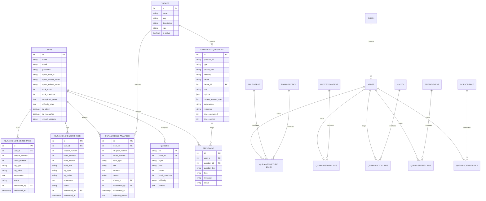

# 🌟 The Eternal Echo & Quranic Lens

### *AI-Powered Islamic Learning & Collaborative Research Ecosystem*

[](https://laravel.com)
[](https://kotlinlang.org)
[](https://tailwindcss.com)
[](https://ai.google.dev/)

**The Eternal Echo & Quranic Lens** is a state-of-the-art educational platform and collaborative academic research engine designed to transform how we learn, review, and connect with the Holy Quran and the Seerah (life) of Prophet Muhammad ﷺ. Developed under the **Asloob ul Hayat Project**, it fuses modern generative artificial intelligence (utilizing Google's **Gemini 1.5 Flash API**) with classical theological datasets, providing students, scholars, and researchers with an interactive web portal, developer APIs, and a native mobile companion app.

---

## 📖 Table of Contents
1. [Core Pillars & Features](#-core-pillars--features)
2. [Technology Stack](#-technology-stack)
3. [System Architecture & Database Schema](#-system-architecture--database-schema)
4. [Installation & Setup](#-installation--setup)
   - [Web Backend Setup](#1-web-backend-setup)
   - [Android Mobile App Setup](#2-android-mobile-app-setup)
5. [Developer API Reference](#-developer-api-reference)
6. [Artisan CLI Commands](#-artisan-cli-commands)
7. [Contributing & Support](#-contributing--support)

---

## 🕌 Core Pillars & Features

### 1. The Eternal Echo (Islamic Quiz & Learning Platform)
* **Para-by-Para Quran Quizzes**: Comprehensive assessments spanning all 30 Paras (Juz) of the Holy Quran, featuring 3 cognitive difficulty levels (*Easy*, *Medium*, *Hard*).
* **Chronological Seerah Timelines**: Sequential multiple-choice questions charting major eras, including Early Life, the Revelation, Makkah persecution, the Hijrah, and life in Madinah.
* **On-the-Fly AI Question Generation**: Powered by the [`GeminiService`](/nur-al-quran-and-seerah-daily/app/Services/GeminiService.php). If the pre-seeded question bank lacks questions matching a selected theme, difficulty, or Para, the application dynamically synthesizes fresh, high-quality MCQs using strict JSON Schema constraints.
* **Personalized Daily Insights**: Informational articles detailing Quranic history (preservation, linguistic miracles) and Seerah narratives, accompanied by interactive review questions.
* **Quran.com OAuth & Profile Sync**: Authenticating via Quran.com automatically links user profiles to synchronize reading milestones, pull reading streaks, and update the Quran Foundation API.
* **Passwordless OTP Authentication**: Fast, secure verification via a 6-digit email OTP. The login flow generates a personalized spiritual welcome greeting dynamically generated by AI based on the user's email.
* **Gamified Tracking & Community**: Real-time global leaderboards, learning streaks, accuracy stats, and bookmarking systems to build a custom study notebook.

### 2. Quranic Lens (Academic Collaborative Research Framework)
* **Verse Connection Directory**: Cross-references Quranic verses with:
  * **Hadith**: Links verses with authenticated narrations.
  * **Seerat**: Maps historical milestones in the Prophet's ﷺ life to specific revelations.
  * **Science**: Highlights correlations with modern scientific facts (biology, mathematics, cosmology).
  * **History**: Contextualizes events in world history.
  * **Scripture**: Compares biblical (Torah/Bible) parallel references.
* **Researcher Directory & Roles**: Allows qualified scholars to register via the Researchers directory. Once approved by administrators, researchers can submit detailed research commentaries.
* **Collaborative Tagging & Analyses**: Authenticated researchers can apply:
  * **Word-Level Tags**: (Root words, grammatical roles, thematic significance).
  * **Verse-Level Tags**: (Theological principles, legal rulings, prophecies).
  * **Academic Analyses**: Multi-layered theological, scientific, and linguistic essays.
* **Moderation Workflows**: A double-sync approval pipeline for administrators and senior researchers to audit pending analyses, tags, and connection links.

### 3. Android Mobile Companion App
* **Kotlin & Jetpack Compose Frontend**: Clean, responsive native Android UI utilizing Coroutines for asynchronous network tasks.
* **Auth Integration**: OTP registration and secure login/password set/change syncing.
* **Surah & Connection Viewer**: Read through all 114 Surahs and query structural connection data (Science, Seerah, Hadith, History, Scripture) on any verse dynamically.
* **Theme-Based Quizzing**: Request custom quizzes by theme and difficulty, directly updating the global database.
* **Live Leaderboards**: View global scores and rank on mobile.

---

## 🛠️ Technology Stack

* **Backend Web Framework**: [Laravel 12.x](file:///d:/nur-al-quran-and-seerah-daily/app) (featuring robust routing, Eloquent ORM, Sanctum APIs, and secure middleware).
* **Asset Bundler & Frontend Reactive System**: Vite + Alpine.js.
* **CSS & Styling System**: Tailwind CSS v4.0.0 (custom HSL color palette, dark mode, glassmorphism).
* **Database**: SQLite (local development / caching) & MySQL (scalable production support).
* **AI Integration Core**: Google Gemini 1.5 Flash API.
* **Android Native App**: Kotlin 1.9+, Jetpack Compose, HTTP/REST API Gateway.

---

## 🗃️ System Architecture & Database Schema

The following entity-relationship diagram outlines the core schemas powering the collaborative platform, illustrating how users, quiz logs, generated questions, and multi-layered Quranic Lens tables interconnect:


```mermaid
erDiagram
    USERS ||--o{ QUIZZES : completes
    USERS ||--o{ FEEDBACKS : submits
    USERS ||--o{ QURANIC-LENS-ANALYSES : authors
    USERS ||--o{ QURANIC-LENS-WORD-TAGS : tags
    USERS ||--o{ QURANIC-LENS-VERSE-TAGS : tags
    THEMES ||--o{ GENERATED-QUESTIONS : contains
    THEMES ||--o{ QURANIC-LENS-ANALYSES : classifies
    GENERATED-QUESTIONS ||--o{ FEEDBACKS : flags
    
    SURAH ||--o{ VERSE : contains
    VERSE ||--o{ QURAN-SCIENCE-LINKS : maps
    SCIENCE-FACT ||--o{ QURAN-SCIENCE-LINKS : correlates
    VERSE ||--o{ QURAN-SEERAT-LINKS : maps
    SEERAT-EVENT ||--o{ QURAN-SEERAT-LINKS : correlates
    VERSE ||--o{ QURAN-HADITH-LINKS : maps
    HADITH ||--o{ QURAN-HADITH-LINKS : correlates
    VERSE ||--o{ QURAN-HISTORY-LINKS : maps
    HISTORY-CONTEXT ||--o{ QURAN-HISTORY-LINKS : correlates
    VERSE ||--o{ QURAN-SCRIPTURE-LINKS : maps
    BIBLE-VERSE ||--o{ QURAN-SCRIPTURE-LINKS : correlates
    TORAH-SECTION ||--o{ QURAN-SCRIPTURE-LINKS : correlates

    USERS {
        int id PK
        string name
        string email
        string password
        string quran_user_id
        string quran_access_token
        string quran_refresh_token
        int total_score
        int total_questions
        json completed_paras
        json difficulty_stats
        boolean is_admin
        boolean is_researcher
        string expert_category
    }

    QUIZZES {
        string id PK
        int user_id FK
        string type
        string title
        int score
        int total_questions
        string difficulty
        json details
    }

    THEMES {
        int id PK
        string name
        string slug
        string description
        string type
        boolean is_active
    }

    GENERATED-QUESTIONS {
        int id PK
        string question_id
        string type
        string source_info
        string difficulty
        string theme
        int theme_id FK
        string text
        json options
        int correct_answer_index
        string explanation
        string reference
        int times_answered
        int times_correct
    }

    FEEDBACKS {
        int id PK
        int user_id FK
        int question_id FK
        string question_text
        string type
        string message
        string status
    }

    QURANIC-LENS-ANALYSES {
        int id PK
        int user_id FK
        int chapter_number
        int verse_number
        string lens_type
        string title
        text content
        string status
        int theme_id FK
        int moderated_by FK
        timestamp moderated_at
        text rejection_reason
    }

    QURANIC-LENS-WORD-TAGS {
        int id PK
        int user_id FK
        int chapter_number
        int verse_number
        int word_position
        string word_text
        string tag_type
        string tag_value
        text explanation
        string status
        int moderated_by FK
        timestamp moderated_at
    }

    QURANIC-LENS-VERSE-TAGS {
        int id PK
        int user_id FK
        int chapter_number
        int verse_number
        string tag_type
        string tag_value
        text explanation
        string status
        int moderated_by FK
        timestamp moderated_at
    }
```

---

## ⚙️ Installation & Setup

### 1. Web Backend Setup

#### Prerequisites
* **PHP 8.2 or higher**
* **Composer** (PHP dependency manager)
* **Node.js & NPM**
* **SQLite** (or a MySQL instance if using production migrations)

#### Step-by-Step Installation
1. **Clone the Repository:**
   ```bash
   git clone https://github.com/MuhammadSaadSiddique/nur-al-quran-and-seerah-daily.git
   cd nur-al-quran-and-seerah-daily
   ```

2. **Run the Automatic Setup Script:**
   The project contains a pre-configured automation script inside [`composer.json`](file:///d:/nur-al-quran-and-seerah-daily/composer.json) that installs dependencies, duplicates environment templates, generates encryption keys, triggers migrations, and compiles frontend assets:
   ```bash
   composer run setup
   ```

   *Manual step execution fallback:*
   ```bash
   # Install backend libraries
   composer install

   # Setup configuration file
   copy .env.example .env

   # Generate app secure keys
   php artisan key:generate

   # Create SQLite database file
   type nul > database/database.sqlite

   # Migrate schemas
   php artisan migrate --force

   # Install & compile UI files
   npm install
   npm run build
   ```

3. **Configure Environment Variables:**
   Update your API credentials inside your `.env` configuration file:
   ```env
   APP_NAME="The Eternal Echo"
   APP_URL=http://localhost:8000

   DB_CONNECTION=sqlite

   # Google Gemini API key (Mandatory for AI question and analysis generation)
   GEMINI_API_KEY="your-gemini-api-key"

   # Quran.com OAuth Credentials (For Streak & Milestone sync)
   QURAN_CLIENT_ID="your-client-id"
   QURAN_CLIENT_SECRET="your-client-secret"
   QURAN_REDIRECT_URI="http://localhost:8000/oauth/callback"
   QURAN_AUTH_URL="https://quran.com"
   QURAN_API_URL="https://api.quran.com"

   # Mail settings (For user registration/login OTP deliveries)
   MAIL_MAILER=smtp
   MAIL_HOST=smtp.mailtrap.io
   MAIL_PORT=2525
   MAIL_USERNAME=your-smtp-username
   MAIL_PASSWORD=your-smtp-password
   ```

4. **Boot the Development Ecosystem:**
   Run the unified development command to launch Vite, local PHP server, logs tailer, and background queue workers concurrently:
   ```bash
   composer run dev
   ```
   Open `http://localhost:8000` in your web browser.

---

### 2. Android Mobile App Setup

#### Prerequisites
* **Android Studio Koala** or newer.
* **JDK 17** configured in your project settings.
* An Android Virtual Device (AVD) or a physical Android device connected via ADB.

#### Project Configuration & Build
1. Open the [mobile-app](file:///d:/nur-al-quran-and-seerah-daily/mobile-app) folder inside Android Studio.
2. Open [`ApiClient.kt`](file:///d:/nur-al-quran-and-seerah-daily/mobile-app/app/src/main/java/com/example/eternalechomobile/data/ApiClient.kt) and configure your backend endpoint IP:
   ```kotlin
   private const val BASE_URL = "http://<YOUR_LOCAL_IP>:8000/api/v1/mobile.php"
   ```
3. Sync Gradle and build the project.
4. Run the application from Android Studio, or compile the debug APK using the CLI:
   ```bash
   # In the /mobile-app directory
   ./gradlew assembleDebug
   ```

---

## 🧪 Testing

### Backend Unit & Integration Tests
Execute the full Laravel PHPUnit test suite:
```bash
composer run test
```

### Mobile App UI/VM Tests
* Run instrumented tests: `./gradlew connectedAndroidTest`
* Run local JUnit unit tests: `./gradlew test`

---

## 🌐 Developer API Reference

For full schemas, see the complete [API Documentation](file:///d:/nur-al-quran-and-seerah-daily/docs/api.md).

### Base Headers
```http
Accept: application/json
Content-Type: application/json
```

### Authentication Modes
1. **Sanctum User Token**: Required for posting research analyses (`Authorization: Bearer <token>`). Get token via `POST /api/token`.
2. **Admin Token**: Required for bulk question uploading (`X-Admin-Token: <token>`).

### Endpoint Summary

#### 🔑 Get Token (`POST /api/token`)
* Get a Sanctum token for authenticated academic contributions.
* **Payload**: `{"email": "...", "password": "..."}`

#### 📚 Get Research (`GET /api/research`)
* Fetches paginated analyses list.
* **Filters**: `lens_type`, `chapter_number`, `verse_number`, `theme_id`, `status` (pending/approved, viewable only by moderators).

#### ✍️ Post Research (`POST /api/research`)
* Submit a new analysis commentary.
* **Payload**:
  ```json
  {
    "chapter_number": 30,
    "verse_number": 48,
    "lens_type": "science",
    "title": "Atmospheric Science & Rain Formation",
    "content": "This verse describes how clouds are spread across..."
  }
  ```

#### 📦 Bulk Upload Quizzes (`POST /api/upload-questions`)
* Upload list of generated questions. Requires `X-Admin-Token`.

---

## 💻 Artisan CLI Commands

* **`php artisan app:sync-themes`**
  Queries generated questions and synchronizes distinct themes to the `themes` table automatically.
* **`php artisan app:migrate-to-mysql`**
  Migrates pre-seeded database content (Surahs, verses, translations) from local SQLite to a MySQL server production instance.
* **`php artisan app:update-para-numbers`**
  Recalculates and updates Para/Juz associations for questions depending on Surah/Ayat reference formats.
* **`php artisan send:weekly-research-promo`**
  Assembles newly approved academic analyses from the last 7 days and delivers a promotional digest newsletter to all subscribers.

---

## 🤝 Contributing & Support

We welcome contributions from developers, scholars, and designers alike!
1. Fork the repository and create a feature branch (`git checkout -b feature/amazing-change`).
2. Make your modifications, write tests, and ensure tests pass.
3. Push your branch and open a Pull Request.

For feedback, support, or to join the **Asloob ul Hayat Project** community, please visit [asloobulhayat.com](https://asloobulhayat.com/).

---

<p align="center">
  <em>"May this platform serve as a continuous source of light and guidance on your journey toward deeper Islamic knowledge."</em> ✨
</p>
